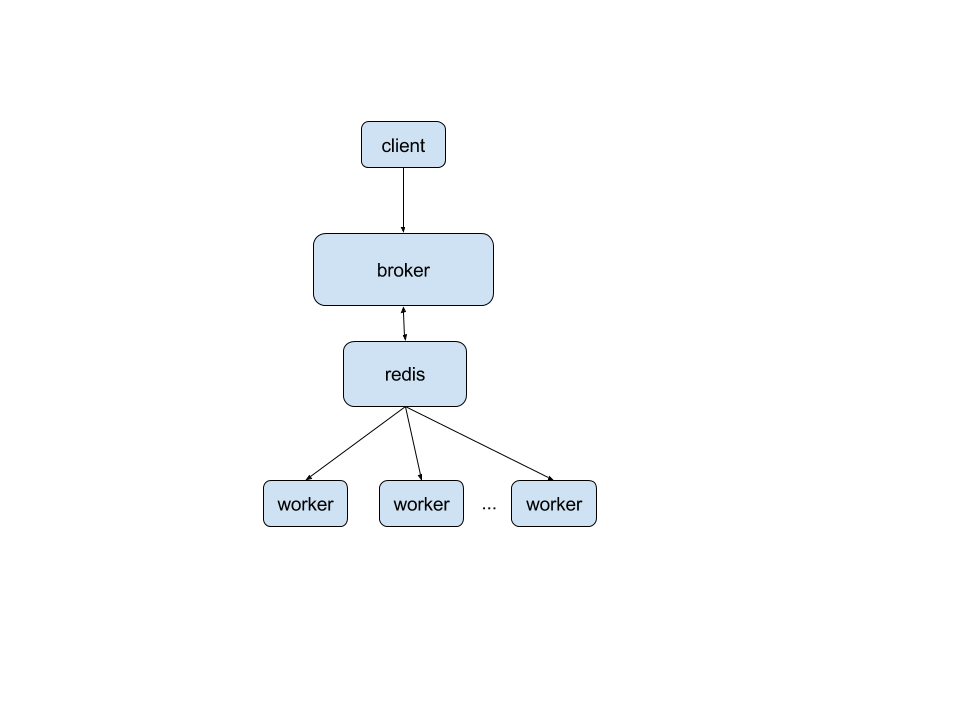

# 1. kingtask简介
kingtask是一个由Go开发的异步任务系统。主要特性包含以下几个部分：

1. 支持定时的异步任务。
2. 支持失败重试机制，重试时刻和次数可自定义。
3. 任务执行结果可查询。
4. 一个异步任务由一个可执行文件组成，开发语言不限。
5. 任务是无状态的，执行异步任务之前，不需要向kingtask注册任务。
6. broker和worker通过redis解耦。
7. 通过配置redis为master-slave架构，可实现kingtask的高可用，因为worker是无状态的，redis的master宕机后，可以修改worker配置将其连接到slave上。

# 2. kingtask架构
kingtask架构图如下所示：


kingshard的实现步骤如下所述：

1. broker收到client发送过来的异步任务（一个异步任务由一个唯一的uuid标示）之后，判断异步任务是否定时，如果未定时，则直接将异步任务封装成一个结构体，存入redis。如果定时，则通过定时器触发，将异步任务封装成一个结构体，存入redis。
2. worker从redis中获取异步任务，或者到任务之后，执行该任务，并将任务结果存入redis。
3. 对于失败的任务，如果该任务有重试机制，broker会重新发送该任务到redis，然后worker会重新执行。

# 3. kingtask使用

## 3.1 配置broker

```
#broker地址
addr : 0.0.0.0:9595
#redis地址
redis : 127.0.0.1:6379
#log输出到文件，可不配置
#log_path: /Users/flike/src 
#日志级别
log_level: debug
```

# 3.2 配置worker

```
#broker地址
broker : 127.0.0.1:9595
#redis地址
redis : 127.0.0.1:6379
#异步任务可执行文件目录
bin_path : /Users/flike/src
#日志输出目录，可不配置
#log_path : /Users/flike/src
#日志级别
log_level: debug

#每个任务执行时间间隔，单位为秒
period : 1
#结果保存时间，单位为秒
result_keep_time : 1000
#任务执行最长时间，单位秒
task_run_time: 30
```

## 3.3 运行broker和worker

```
#将异步任务的可执行文件放到bin_path目录
cp example /Users/flike/src
#转到kingtask目录
cd kingtask
#启动broker
./bin/broker -config=etc/broker.yaml
#启动worker
./bin/worker -config=etc/worker.yaml
```

### 3.3.1 example异步任务源码

异步任务的结果需要输出到标准输出(os.Stdout),出错信息需要输出到标准出错输出(os.Stderr)。

```
//example.go
package main

import (
	"fmt"
	"os"
	"strconv"
)

func main() {
	if len(os.Args) != 3 {
		fmt.Fprintf(os.Stderr, "args count must be two")
		return
	}
	left, err := strconv.ParseInt(os.Args[1], 10, 64)
	if err != nil {
		fmt.Fprintf(os.Stderr, "err:%s", err.Error())
		return
	}
	right, err := strconv.ParseInt(os.Args[2], 10, 64)
	if err != nil {
		fmt.Fprintf(os.Stderr, "err:%s", err.Error())
		return
	}
	sum := left + right
	fmt.Fprintf(os.Stdout, "%d", sum)
}

```

### 3.3.2 调用异步任务源码

```
//mytask.go
package main

import (
	"fmt"
	"time"

	"wps.cn/kingtask/task"
)

func main() {
	brokerAddr := "127.0.0.1:9595"
	//example异步任务的参数
	args := []string{"12", "45"}

	brokerClient, err := task.NewBrokerClient(brokerAddr)
	if err != nil {
		fmt.Println(err.Error())
		return
	}
	//失败重试的时间间隔序列，也就是失败后隔5s后重试这个异步任务，如果再次失败就8s后再重试
	timeInterval := []int{5, 8, 9}
	//第一个参数：可执行文件名
	//第二个参数：异步任务参数，必须是string类型
	//第三个参数：异步任务的开始时间戳，如果是未来的一个时刻，则到时后执行异步任务。如果为0则立即执行
	//第四个参数：失败重试时间序列
	t, err := task.NewTaskRequest("example", args, 0, timeInterval)
	if err != nil {
		fmt.Printf("NewTaskRequest error:%s\n", err.Error())
		return
	}
	err = brokerClient.Delay(t)
	if err != nil {
		fmt.Printf("Delay error:%s\n", err.Error())
		return
	}
	time.Sleep(time.Second * 2)
	reply, err := brokerClient.GetResult(t)
	if err != nil {
		fmt.Printf("GetResult error:%s\n", err.Error())
		return
	}
	fmt.Println(reply)
	brokerClient.Close()
}
```

执行结果:

```
//第一个1表示结果存在，因为异步任务有可能还未执行，所以结果有可能不存在
//第二个1表示异步任务执行成功
//第三个参数表示异步任务的结果
&{1 1 57}
```